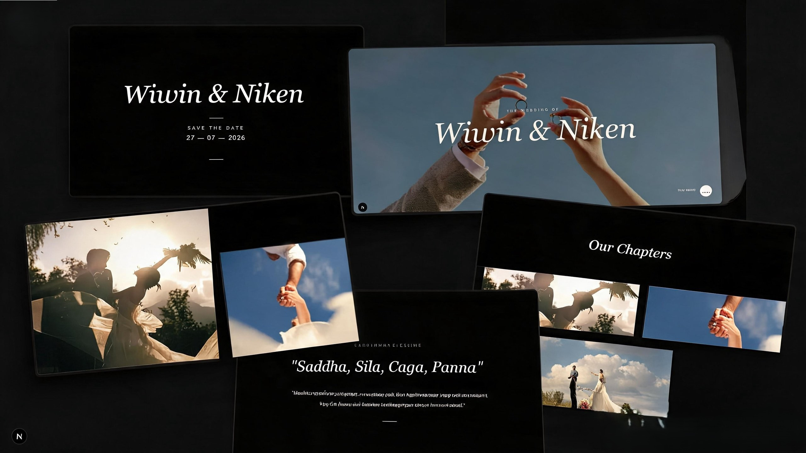

# 🎞️ Wedding Gallery — Wiwin & Niken

<p align="center">
  
</p>

<p align="center">
  A cinematic and immersive wedding gallery experience built with modern web technologies.
</p>

---

# ✨ Description

Wedding Gallery — Wiwin & Niken is a web-based wedding gallery application designed with a cinematic and immersive storytelling approach.

The website presents memorable moments of the couple through smooth animations, artistic layouts, and meaningful Buddhist spiritual values.

This project focuses on creating an emotional and interactive browsing experience where users can enjoy every section naturally as if watching a visual story.

---

# 🚀 Features

- 🎬 Cinematic Hero Section with smooth zoom and fade animations
- ↔️ Dual Horizontal Scroll storytelling sections
- 🖼️ Artistic Masonry Grid gallery layout
- ☸️ Buddhist Wisdom Integration using Paritta quotes
- 🎵 Interactive floating music player with sound visualizer
- 📱 Fully responsive design for mobile, tablet, and desktop
- ⚡ Optimized image loading using WebP format

---

# 🛠️ Technologies Used

| Technology        | Description                                   |
| ----------------- | --------------------------------------------- |
| **Next.js 15**    | Main framework for building the application   |
| **TypeScript**    | Type-safe and scalable development            |
| **Framer Motion** | Scroll-linked cinematic animations            |
| **Tailwind CSS**  | Utility-first CSS framework for styling       |
| **WebP**          | Optimized image format for better performance |

---

# 🔧 Installation

Clone the repository:

```bash
git clone https://github.com/Dwikalintangn/Wedding-Galleri-Next.js.git
```

Go to the project directory:

```bash
cd Wedding-Galleri-Next.js
```

Install dependencies:

```bash
npm install
```

Run the development server:

```bash
npm run dev
```

Open in browser:

```bash
http://localhost:3000
```

---

# 📄 License

This project is created for personal and portfolio purposes.

© 2026 — Dwika Lintang Nugraha
